<a name="manager" />
# Manager

## Manager overview and per-unit views
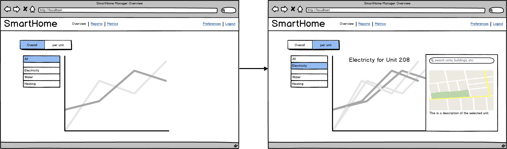

## Manager view reports

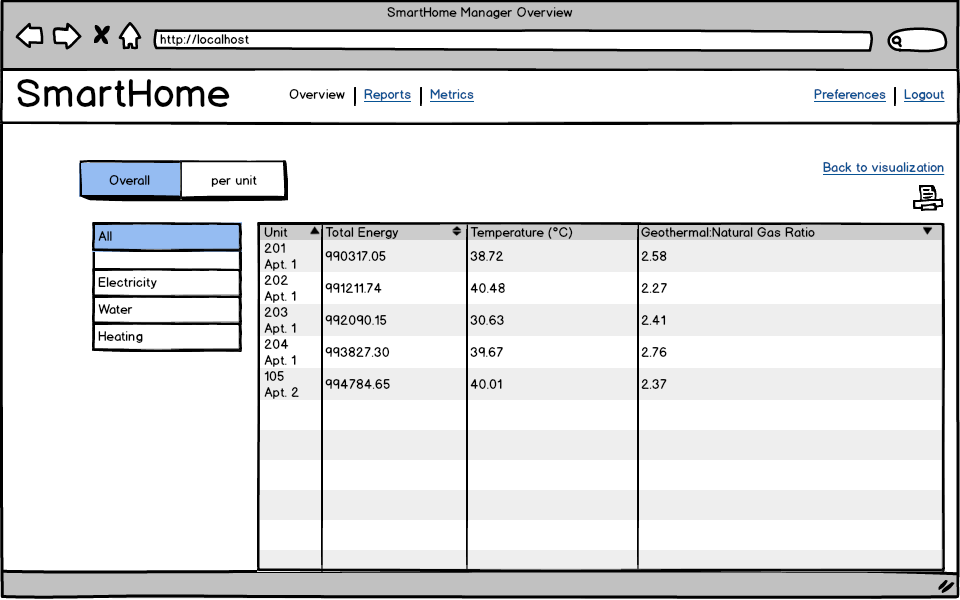

<a name="engineer" />
# Engineer

## [Engineer Use Case 1][]

[Engineer Use Case 1]: Requirements-Document#wiki-uc-engineer

## Engineer select metrics
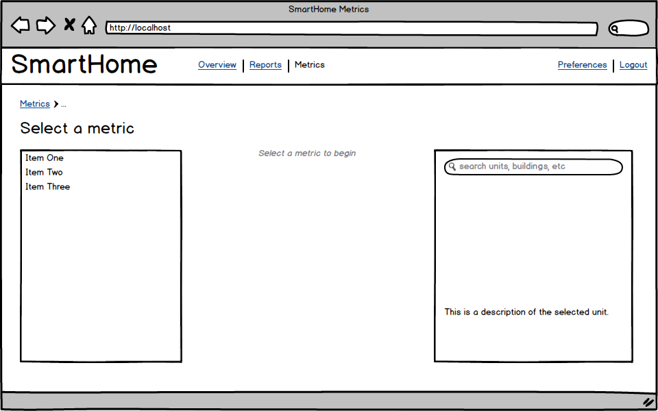

## Engineer metrics view
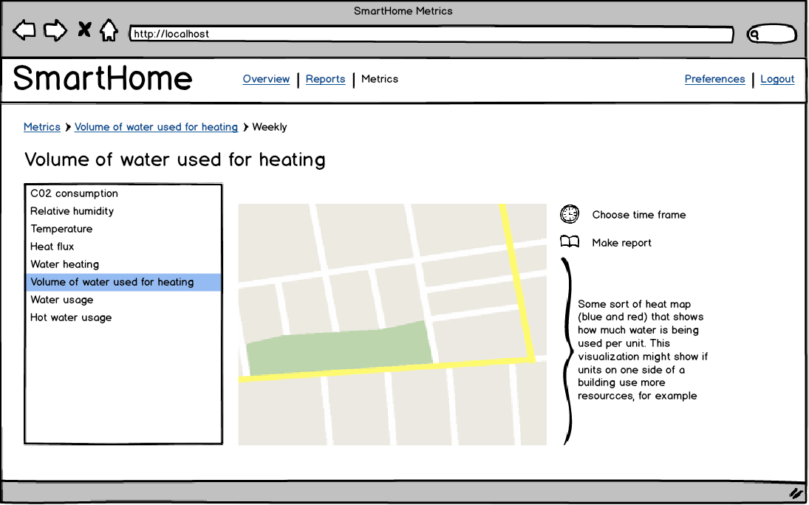

<a name="resident" />
# Resident

## Resident Login:
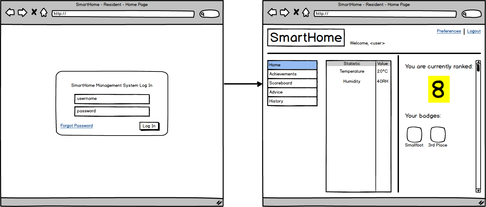

## Resident Preferences:
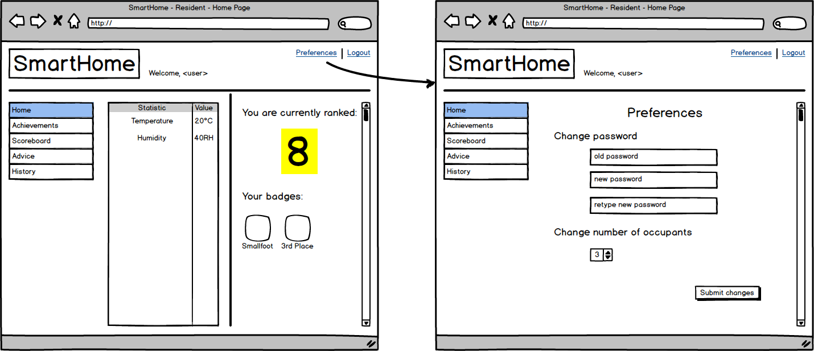

## Resident change history view type from chart to graph:
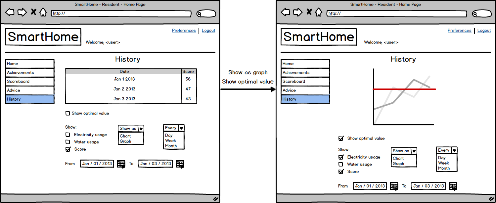

# User can go from any of the following pages to any other page using the links in the sidebar: 

## Resident Homepage 
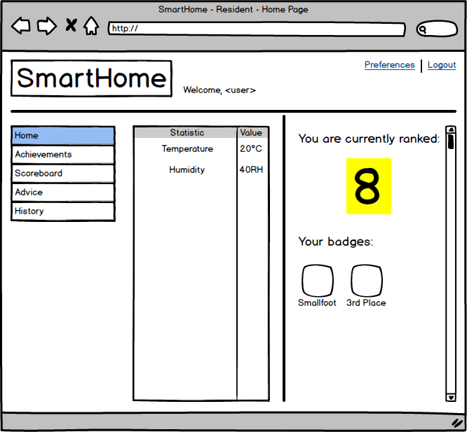

## Resident Achievements 
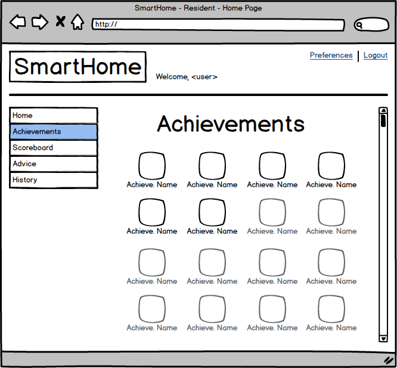

## Resident Scoreboard 
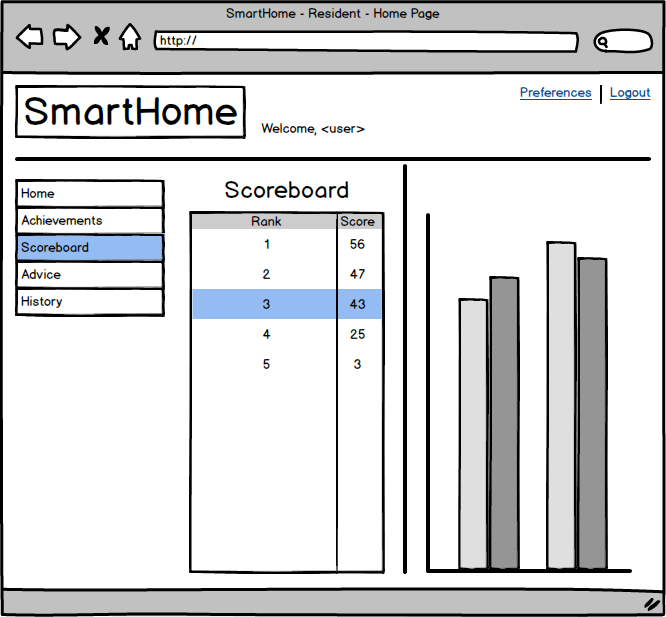

## Resident Advice 
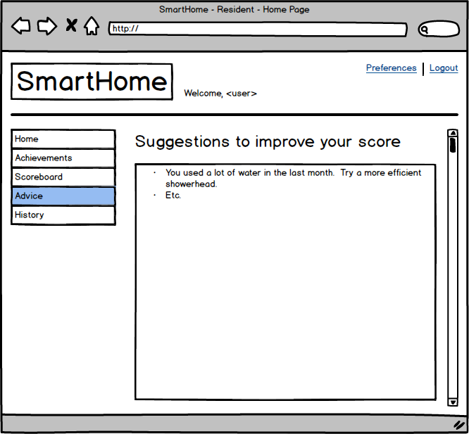

## Resident History 
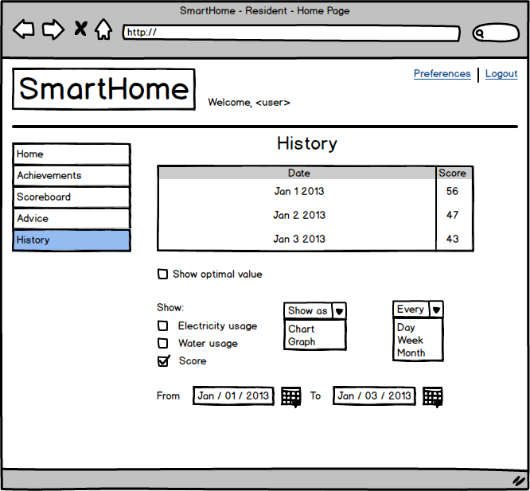
